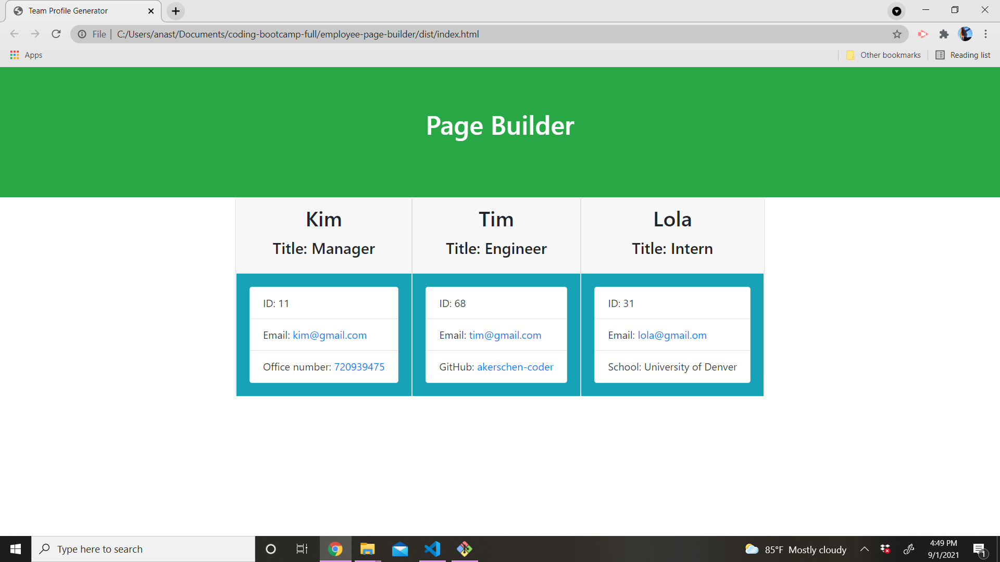

# Employee Page Builder 
  
  ## Description

  This app allows for a manager to create a team including an engineer (name, role, id, github), intern (name, role, id, school) and dynamically renders the information prompted by the user to create a html that puts all roles into a card and displays their information 
  ## Tests

  Through the _test_ folder 
  ## Video Run Through
  Youtube link: https://youtu.be/lDZmSTrVExI 

  ## Screenshot of site 
  ;